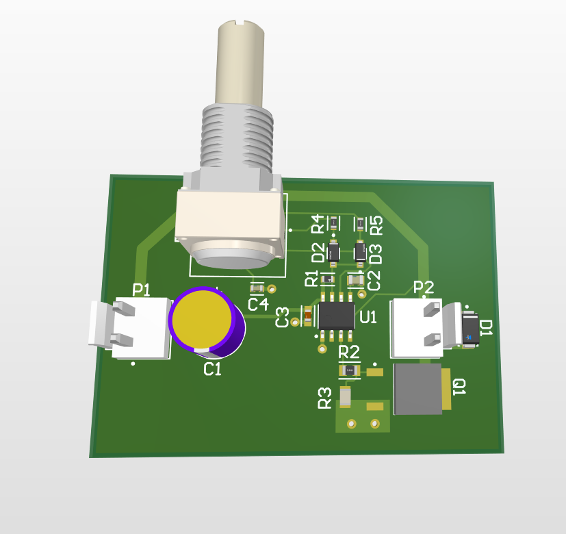
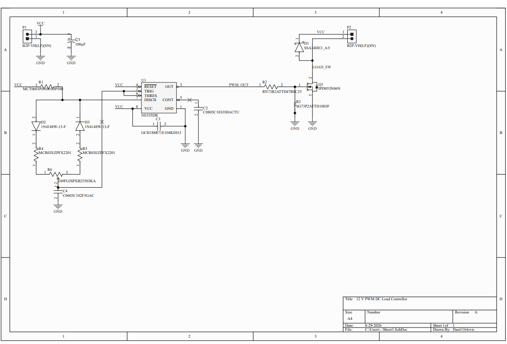
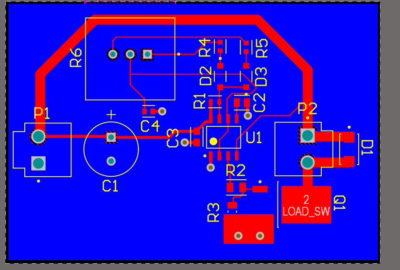

# 12V PWM DC Load Controller

A compact 2-layer PWM controller for 12 V DC loads, designed in Altium Designer.

The project is based on an NE555 timer and an N-channel MOSFET low-side power stage.
It was created as a practical PCB design project focused on schematic design,
component selection, power routing, grounding, DFM and manufacturing output generation.

## Overview

The controller generates an adjustable PWM signal at approximately 25 kHz and
switches an external 12 V load using a power MOSFET.

The output can be used with PWM-compatible resistive and inductive loads such as:

- DC motors
- solenoids
- lamps
- resistive heaters
- other 12 V DC loads

A Schottky flyback diode is included for inductive loads.

## Main Features

| Parameter | Value |
|---|---|
| Input voltage | 12 V DC nominal |
| PWM controller | NE555 |
| PWM frequency | ~25 kHz |
| Duty-cycle control | 50 kΩ linear potentiometer |
| Output topology | N-MOSFET low-side switch |
| MOSFET | Infineon IPD053N06N |
| Flyback diode | Vishay SSA34HE3 |
| Target load current | up to ~2 A |
| PCB layers | 2 |
| PCB material | FR-4 |
| PCB thickness | ~1.6 mm |
| Copper thickness | 1 oz |
| PCB software | Altium Designer |

> The ~2 A load capability is a design target. Physical load and thermal
> validation will be performed after PCB assembly.

## Schematic

The circuit consists of three main functional blocks:

1. 12 V input and local decoupling
2. NE555 adjustable PWM generator
3. N-channel MOSFET power output stage

The NE555 uses separate capacitor charge and discharge paths through two
1N4148W diodes, allowing duty-cycle adjustment with a single potentiometer.

A 1 nF C0G timing capacitor was selected for good frequency stability.

## PCB Design

The PCB uses a nearly continuous ground plane on the bottom layer.

The MOSFET source is connected to the ground plane through a wide local copper
area and multiple vias to reduce resistance and inductance in the load-current
return path.

The flyback diode is placed close to the output connector and switching stage
to keep the high-current freewheel loop compact.

## Design Verification

Final Altium PCB Design Rule Check:

- 0 warnings
- 0 rule violations
- 0 unrouted nets

The schematic was also checked using Altium schematic validation/ERC.

